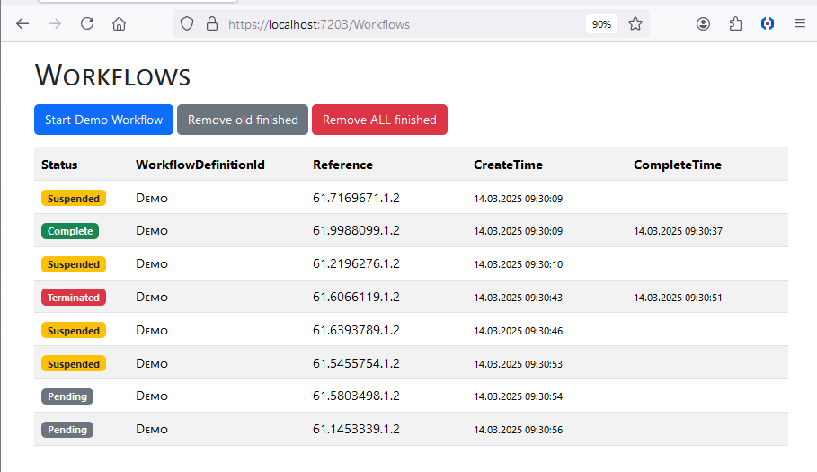
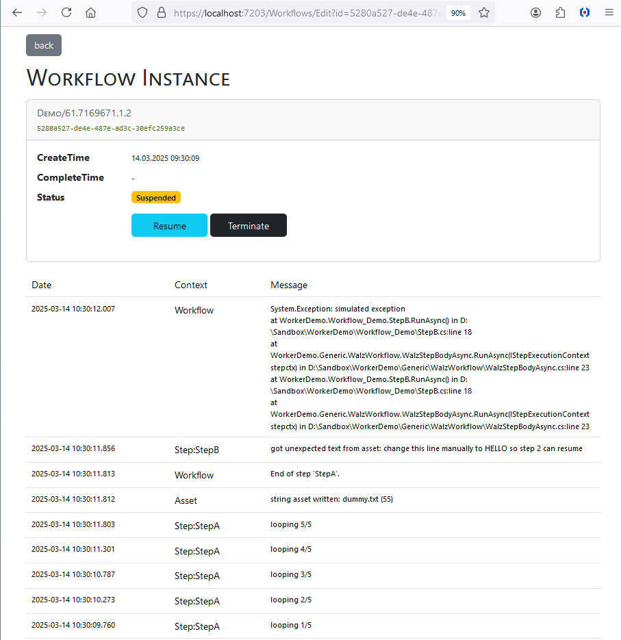
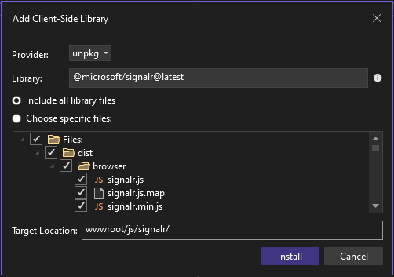

## Description
This can be used as a template for an app that uses
Daniel Gerlags workflow-core library
inside a windows service with a web ui for management.

## Recommendations
- You have to specify a business key (BK) as the workflows REFERENCE when
starting it, like so:
  ```
  var BK = "order.5023423499";
  await host.StartWorkflow("checkoutmail", null, BK);
  ```
  The asset directory will be named after the BK.
  Make sure it does not contain invalid path characters like colon ':' etc.!
  (could have named it like the WorkflowInstanceId but decided against it)
- I like to use the workflow engine in a simple fashion, just
to perform one step after another, and suspend if something unexpected happens. 
- I like to store all business relevant data in the file system
  for various reasons. (instead of using workflow-core's db for that)
  That also means if I want to pass some initial data to a workflow I
  will put it in the asset directory instead of letting workflow-core handle it.

## WalzWorkflow
I made generic classes which address some of our usual
requirements and put them in the folder 'WalzWorkflow'.\
For a usage example please check out the folder 'Workflow_Demo'.

## Management UI
We want an overview of workflows, especially unfinished ones.\
We want to see the details of a failed workflow and
a button to easily retry at its current step. (e.g. after manual intervention)\
The UI uses active directory/cookie authentication in order to
identify the users who resume/terminate worfklows.




## Assets
We want to use a folder for each workflow to store related data.\
This is so you can easily save intermediate files in one step
and use them in a later step.\
(for example, create a pdf in step 1 and send it via mail in step 2)
The base directory of the assets can be controlled with appsettings.json.

## Traceability
We want a history of what happened, stored separately for each workflow:
- meta info, like at what time the individual steps started
- custom logs
- exceptions
- user interactions (resuming / termination)

## Note about obsolete method in library
- GetWorkflowInstances is marked as obsolete
- I'm still using it, as its useful and there is no alternative in the API yet
- a workaround could be to bypass the API and access the DB directly
- see https://github.com/danielgerlag/workflow-core/discussions/861


## Ideas
- assets should be purged at some point too (together with workflows?)
  we use a separate automated script file for now

## Some notes if you want to use it in your app
- I installed signalr "as a client library", see libman.js
  
- Remove jQuery (in _Layout.cshtml and from wwwroot)
- Nuget Packages
  - WorkflowCore
  - WorkflowCore.Persistence.Sqlite
  - Microsoft.Extensions.Hosting.WindowsServices
- I think you could simply copy the following directories
  - Pages/Account 
  - Pages/Workflows
  - Generic/WalzWorkflow
- I used SQLite to be independent of a standalone db server
- check out what you need from Program.cs, it has comments
- Complete/Terminated workflows get purged after 14 days
  (see CleanupWorkflowService.cs)

